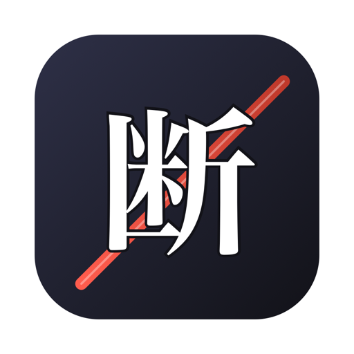

<p align="center"></p>
<h1 align="center">Tatsu</h1>
<p align="center"><b>断</b> · <i>tatsu</i> · to cut off, to sever<br>Offline kanji lookup for iPhone, iPad, Mac and Android.</p>

---

Type English, hiragana, katakana, romaji, or paste a sentence of kanji. Get the character, every reading with its kana and romaji, meanings, stroke count, school grade, JLPT level, and frequency rank. No account, no network.

## Install

From the App Store (iPhone, iPad and Mac). To build it yourself, open `apple/Tatsu.xcodeproj` in Xcode 26 or later and press Run.

Android: from Google Play (phones, tablets, foldables). To build it yourself, install JDK 17 and run `./gradlew assembleDebug` in `android/`.

## Search

| You type | You get |
|---|---|
| `water` | 水 first, then anything meaning water |
| `watr`, `mountian` | same results, one typo or swapped letters is forgiven |
| `みず` / `ミズ` | kana readings, katakana is normalised |
| `taberu` | romaji readings, plus near misses like 立てる *tateru* |
| `日本語` | each kanji in the text, in order |

Ranking: exact match, then prefix, then whole word, then substring, then one edit away, then scattered letters. Ties go to the more frequent kanji.

Tap a kanji to see its details. Copy it from the detail view, or long-press (right-click on Mac) a result. Kanji you open or copy appear under Recent when the search box is empty. Recent lookups stay on the device.

Android: select text in any app and choose Tatsu from the selection menu to look it up.

Can't type a kanji on iPhone? Add the Chinese – Handwriting keyboard and draw it. On Android, add Gboard's Japanese Handwriting layout.

## Project layout

| Path | Role |
|---|---|
| `apple/Tatsu/Search.swift` | Kana to romaji, normalisation, scoring. |
| `apple/Tatsu/Kanji.swift` | Data model and loader. |
| `apple/Tatsu/ContentView.swift`, `KanjiDetail.swift`, `AboutView.swift` | SwiftUI interface, shared by all Apple platforms. |
| `apple/Tatsu/Recent.swift` | Recent lookups (SwiftData). |
| `apple/TatsuTests/` | Search, formatting and recent lookup tests. |
| `android/` | Native Android app (Kotlin, Jetpack Compose). Same search and data; Material 3. |
| `data/kanji.json` | Generated from KANJIDIC2, committed so both apps build offline. |
| `data/build_data.py` | Regenerates `kanji.json` from the latest KANJIDIC2. |
| `docs/playstore.md` | Play Console listing text. |

## Test

```sh
xcodebuild -project apple/Tatsu.xcodeproj -scheme Tatsu -destination 'platform=iOS Simulator,name=iPhone 16 Pro' test
```

Tests run on the iOS Simulator in the background; use any simulator from `xcrun simctl list devices available`. If the simulator can't be found by name, use `id=<UDID>` from that list.

### Android

```sh
export JAVA_HOME=$(/usr/libexec/java_home -v 17 2>/dev/null || echo /opt/homebrew/opt/openjdk@17/libexec/openjdk.jdk/Contents/Home)
cd android && ./gradlew test
```

JVM tests read `data/kanji.json` directly. UI tests (`./gradlew connectedDebugAndroidTest`) need an emulator. Gradle copies `data/kanji.json` into the APK at build time; there is only one copy in the repo.

## Releases

Releases are tagged per platform as `iOS-X.Y` and `android-X.Y`, for example `android-0.1`.

## Update the dictionary

```sh
python3 data/build_data.py
```

Then run the tests.

## Data and license

Kanji data is [KANJIDIC2](https://www.edrdg.org/wiki/index.php/KANJIDIC_Project) by the Electronic Dictionary Research and Development Group, used under [CC BY-SA 4.0](https://creativecommons.org/licenses/by-sa/4.0/). App code is MIT. The Android icon glyph 断 is drawn from Noto Serif JP (SIL Open Font License 1.1, https://openfontlicense.org).
